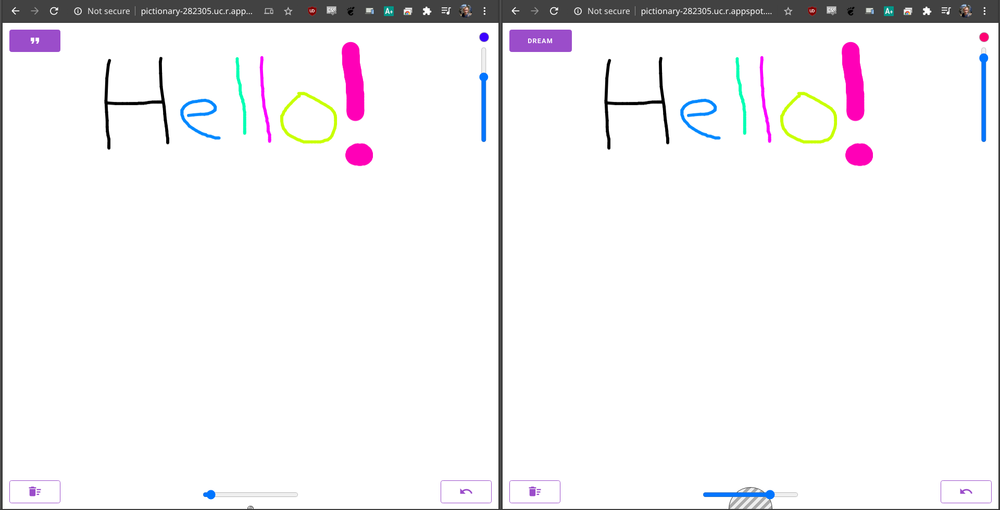
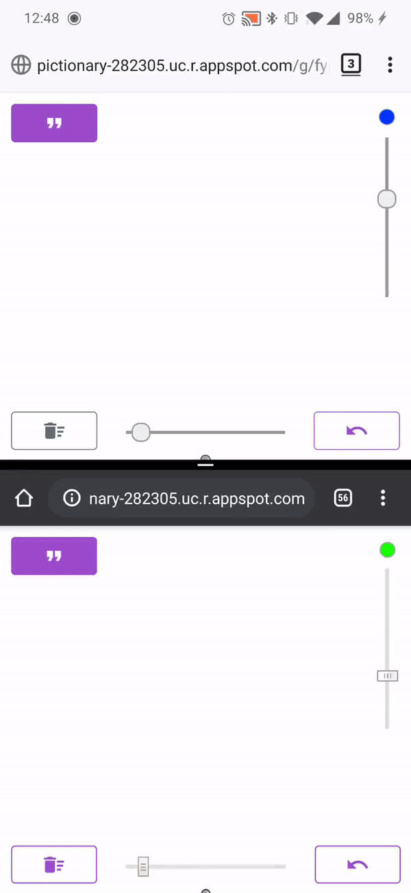

# [Pictionary](http://pictionary-282305.uc.r.appspot.com)

### A minimal browser real-time pictionary game using WebSockets. Generate words, create rooms, customize your brush -- live drawings are transmitted instantly to anyone with the same link.

# Images




# Installation
```
npm install
npm run dev
npm start
```

# Deployment

```
gcloud config set project myproject
gcloud app browse
npm deploy
```
